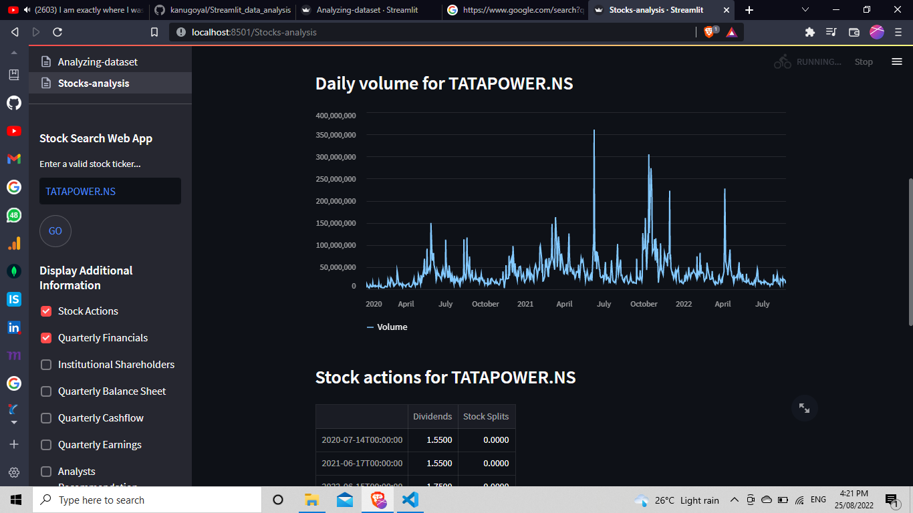
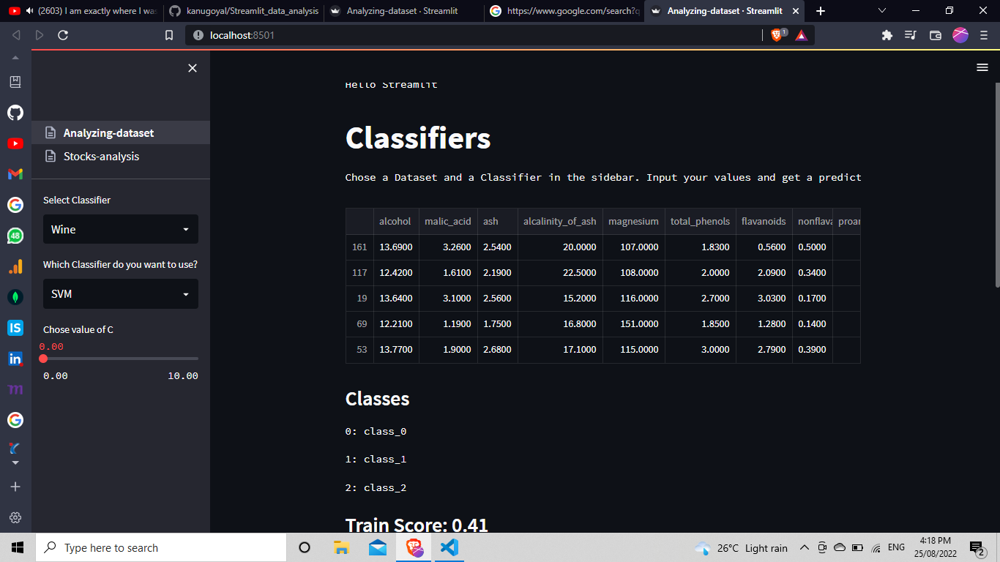
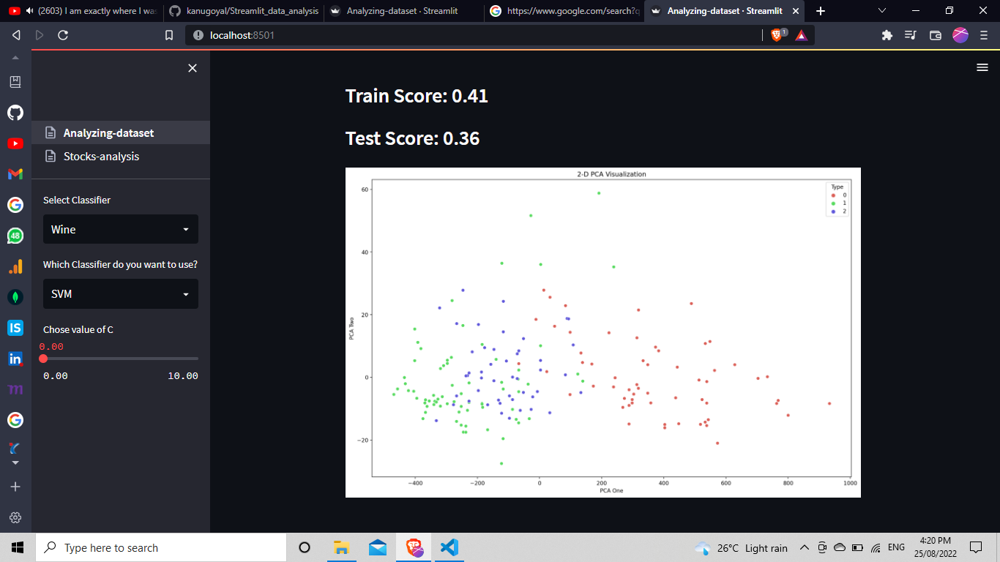

# Web app using Streamlit and sklearn
I tried my hands on Streamlit 
Streamlit is a free, open-source, all-python framework that enables data scientists to quickly build interactive dashboards and web apps with no front-end web development experience required.

### Open web app with:
https://kanugoyal-streamlit-data-analysis-stocks-analysis-hc6k3f.streamlitapp.com/

## Stock Data Analysis
The web app will allow you to search for and retrieve information on any stock from Yahoo! Finance using its ticker and display a line chart of the closing prices, the last closing price, and the daily volume along with some additional information for every stock searched

Make sure your virtual environment is activated before installing the libraries
 python -m venv venv
 venv/Scripts/activate.ps1

## Required packages
 pip install -r requirements.txt
or
 pip install streamlit, seaborn, scikit-learn, matplotlib, yfinance

## Data Analysis on different Dataset

Here, We will use 3 different models (KNN, SVM, Random Forest) for classification and give the user the ability to set some parameters. Before we get started import streamlit, the datasets from sklearn, various models from sklearn, libraries needed to make our plots and pandas

- Creating multipages in streamlit
  * Create main script named Stocks-analysis.py.
  * In same directory, create a new folder named pages
  * Add new .py files in the pages folder.
  * Add numbers before filename like, 01_Analyzing-Dataset.py  to arrange multipages.

  ### Run file using 
   streamlit run Stocks-analysis.py
on windows if error occurs :
   python -m streamlit run Stocks-analysis.py 

 **References**
- https://www.youtube.com/watch?v=Klqn--Mu2pE&t=2291s
- https://luigibruno.medium.com/how-to-easily-build-a-stock-search-web-app-in-python-fada010e5fe

